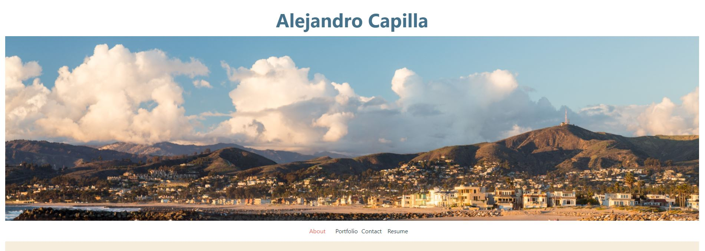
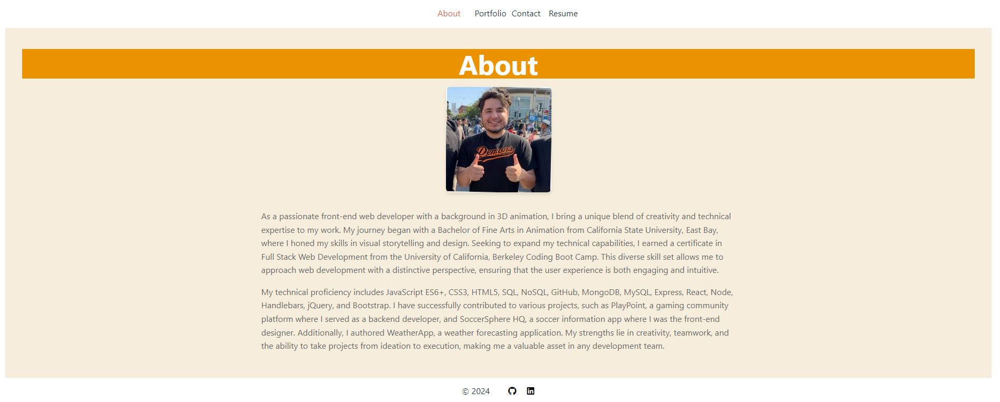
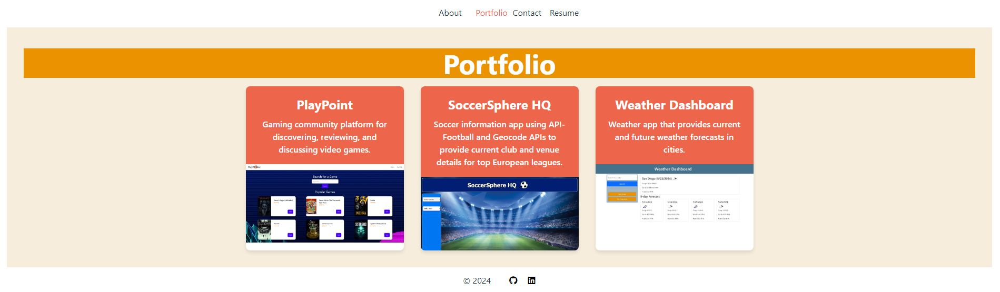
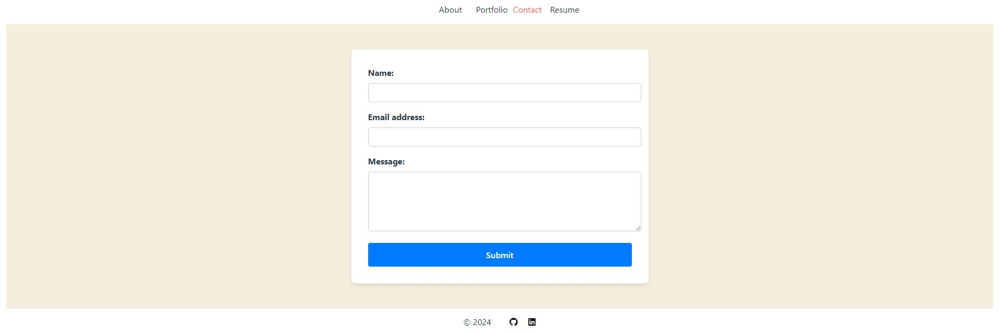
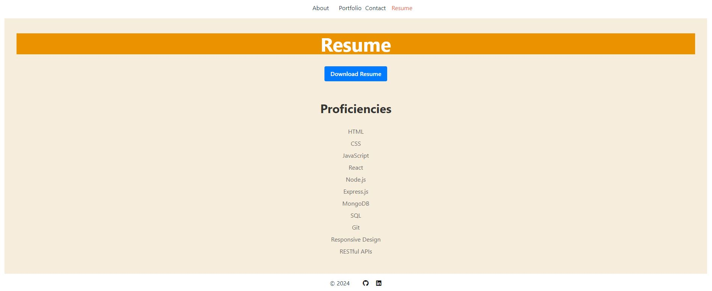

# Developer Portfolio

This is a single-page application (SPA) portfolio website for showcasing a web developer's work, skills, and contact information. The application provides a seamless user experience with smooth navigation between different sections without reloading the page.

## Features

- **Header**: Contains the developer's name and navigation menu.
- **Navigation**: Titles corresponding to different sections of the portfolio. Includes "About Me," "Portfolio," "Contact," and "Resume". The current section title is highlighted.
- **Content Sections**:
  - **About Me**: Displays a recent photo or avatar of the developer and a short bio.
  - **Portfolio**: Shows titled images of six applications with links to both the deployed applications and their corresponding GitHub repositories.
  - **Contact**: Includes a contact form with fields for name, email address, and message. Provides validation notifications for required fields and valid email format.
  - **Resume**: Offers a link to a downloadable resume and a list of the developer’s proficiencies.
- **Footer**: Contains text or icon links to the developer's GitHub, LinkedIn, and a third platform (e.g., Stack Overflow, Twitter).

## Screenshot
- Main Page

 

- About Page



- Portfolio Page



- Contact Page



- Resume Page

 


## User Stories

1. **Header and Navigation**:
   - As a user, I am presented with a header containing the developer's name and navigation titles corresponding to different sections of the portfolio.
   - The navigation includes "About Me," "Portfolio," "Contact," and "Resume". The current section is highlighted.

2. **Default Section**:
   - As a user, when I load the portfolio for the first time, the "About Me" section is selected by default.

3. **About Me Section**:
   - As a user, I see a recent photo or avatar of the developer and a short bio about them in the "About Me" section.

4. **Portfolio Section**:
   - As a user, I see titled images of three of the developer’s applications with links to the deployed applications.

5. **Contact Section**:
   - As a user, I see a contact form with fields for name, email address, and message.
   - I receive a notification if a required field is left empty or if the email address is invalid.

6. **Resume Section**:
   - As a user, I see a link to a downloadable resume and a list of the developer’s proficiencies.

7. **Footer**:
   - As a user, I am presented with text or icon links to the developer’s GitHub and LinkedIn profiles.

## Technologies Used

- HTML
- CSS
- JavaScript (ES6+)
- Framework/Libraries: [React, Vite]

## Setup and Installation

1. Clone the repository:
   ```bash
   git clone https://github.com/AlexCapilla/react-portfolio1.git

2. Navigate to the project directory:
   ```bash
   cd react-portfolio1

3. Install dependencies:
   ```bash
   npm install

4. Start the development server:
   ```bash
   npm start

5. Open your browser and go to http://localhost:3000 to view the portfolio.

## Deployed Link

- To be added

## License

This project is licensed under the MIT License

## Contact

- GitHub: https://github.com/AlexCapilla
- LinkedIn: https://www.linkedin.com/in/alejandro-capilla-58681b19b/
